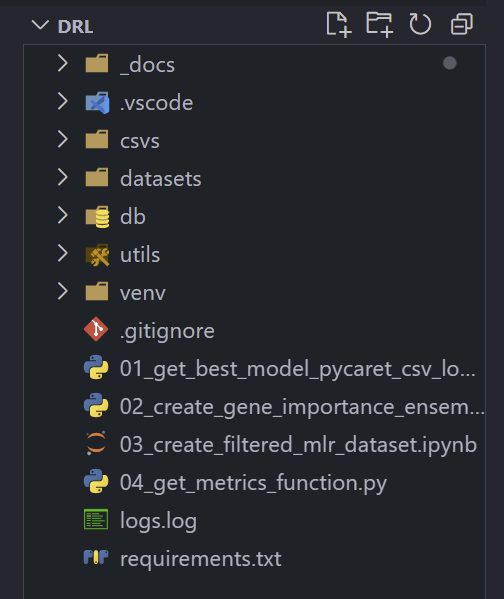

## STEP 01: START - get best hyperparameters and model

Start with **01_get_best_model_pycaret_csv_logging_function.py** which takes a dataset and can be run in loop.

This runs models, produces pycaret's 'best' and we log all the runs in pycaret_results.csv in db:

run_id,run_date,mlr_dataset,split,setup,best,pred_accuracy,metrics_dict, accuracy,precision,recall,f1,roc_auc

## STEP 02: FEATURE IMPORTANCES - create many importances for LogReg/Ensemble methods.

This is for ensenble types as the method to get fetaure importances is different to say LogReg.

They could be refactored into one file as the difference is the fact that log_reg has a different attribute for importances. Being LogReg it also has direction which ensemble models do not have.

We can make the assumption, prior to say SHAP, can give direction of genes for ensemble models.

These csvs of gene importance for LogReg and Ensemble models are stores in **_csvs/gene_importances_**

We can run the modelling again on a reduced feature set based on the importances or use XAI as the featureset is much smaller.

## STEP 03: CREATE REDUCED MLR DATASETS

**03_create_filtered_mlr_dataset.ipynb** will create an MLR with selected features based on a filter applied to merged importances set. This will be stored in **_datasets/reduced_features_mlr_datasets_**.

## STEP 04: METRICS AND PLOTS FOR MODEL - LOG TO FILE

**04_get_metrics_function.py** gets metrics as well as HOLDOUT\_ ACCURACY for a given model_id dereived from **db/pycaret_results.csv**. It will diaply CM etc and then logs TEST_ID, model_id, accuracy to **csvs/test_results.csv**.

By enabling rnd_num_split and rnd_num_hyper to be passed in, we can examine the effect of these random numbers.
